[Back to README.md](../../../README.md)

# Screen Sequence in Images

This is the basic screen sequence for both desktop and mobile organized by flow and page. 

**Legacy Screen Sequence**

Below is a embeded PDF with drawings.

[Download PDF](docs/Founding/IMG/ScreenSequenceDraft.pdf)

# SSD Institute Web App – Wireframe Documentation

## Page Sequence: Home / Landing Page

### Mobile

**Key Elements**
- **Header:** Organization name and logo
- **Main Content:** Mission statement about empowering research and independent inquiry
- **Interactive Feature:** “Drag to draw a sect” tool (touch-enabled)
- **Footer/Call-to-Action:** Social media icons + contact@ssd.org
- **Mobile Layout:** Stacked layout with simplified navigation and icons at bottom

**URL:** /home  
Home / Landing Page
**User Story:**
As a citizen, I want to visit the site and read clear, updated definitions of governance models so that I understand concepts like “collaborative veto,” “multiple choice voting,” and “supreme court veto.” The pages should be dated so that I can determine their recency, be reviewed for accuracy, and displayed in a legible and accessible format. (Priority: High)

**Sprint:** Sprint 1 – Jan 20–Feb 2

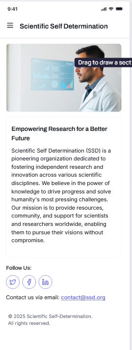

### Desktop

**Key Elements**
- **Header:** “Empowering Informed Decisions Through Data and Dialogue”
- **Main Content:** Paragraph describing SSD’s framework for evidence-based decision-making
- **Visual:** Abstract 3D illustration of translucent spheres
- **Navigation Tabs:** Horizontal links (Collaborative Veto, Supreme Court Check, Multiple Choice Voting, etc.)
- **Footer:** © 2023 Scientific Self-Determination + contact@scientificselfdetermination.com

**URL:** /home  
**User Story:**
As a citizen, I want to visit the site and read clear, updated definitions of governance models so that I understand concepts like “collaborative veto,” “multiple choice voting,” and “supreme court veto.” The pages should be dated so that I can determine their recency, be reviewed for accuracy, and displayed in a legible and accessible format. (Priority: High)

**Sprint:** Sprint 1 – Jan 20–Feb 2

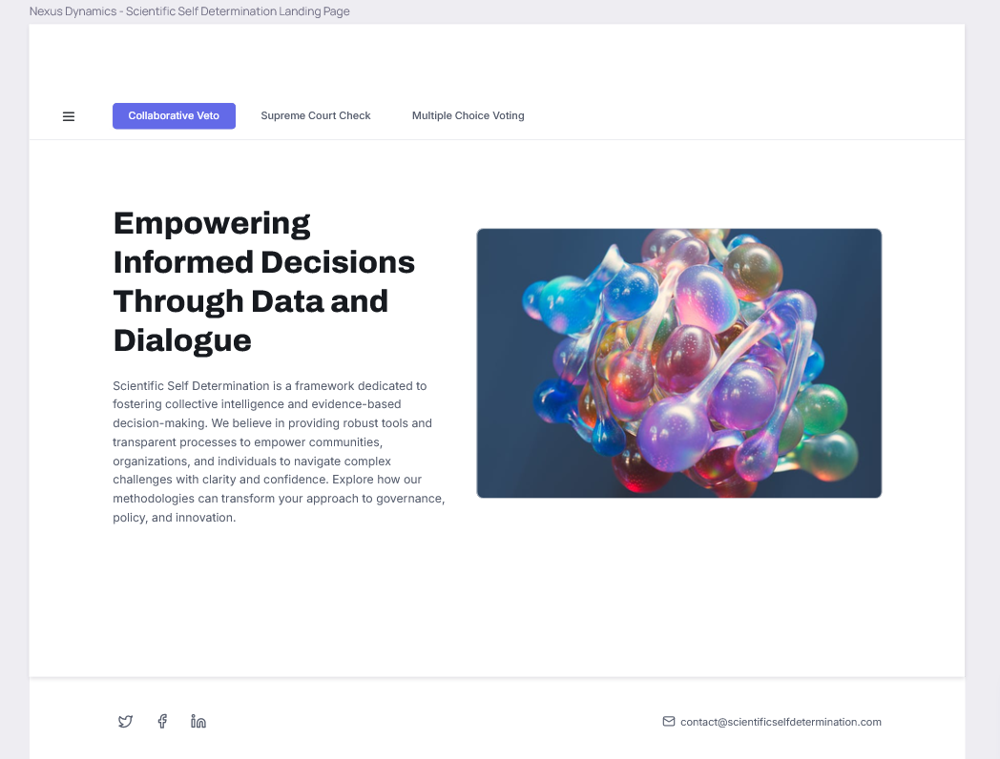

---

## Page Sequence: Collaborative Veto

### Mobile

**Key Elements**
- **Header:** “Scientific Self Determination”
- **Main Content:** “County Participation & Support” map with shading for local support
- **Text Block:** “Empowering Local Governance” explanation of the initiative
- **Footer/Call-to-Action:** Social media icons + contact@ssd.org
- **Mobile Layout:** Stacked content with simplified map and text

**URL:** /collaborative-veto  
**User Story:**
As a citizen, I want to see a county-level map for West Virginia showing which counties would veto a state law, so I can understand local regional variation. The map should support all of the expected features of a modern embedded map and comply with all applicable accessibility features. (Priority: High)

**Sprint:** Sprint 5 – Mar 23–Apr 5

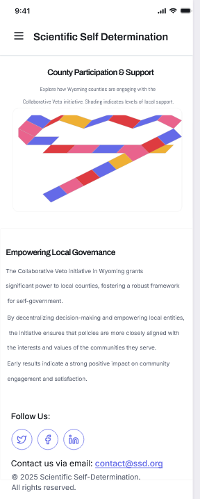

### Desktop

**Key Elements**
- **Title/Subhead:** “Collaborative Veto: Empowering Wyoming’s Local Governance”
- **Main Content:** Explanation of the initiative and its impact
- **Graphical Section:** Interactive map with hover support
- **Metrics Section:** Counties Participating, Approval Rate, Legislation Impacted
- **Footer:** Navigation links + contact@SignificantSelfDetermination.com

**URL:** /collaborative-veto  
**User Story:**
As a citizen, I want to see a county-level map for West Virginia showing which counties would veto a state law, so I can understand local regional variation. The map should support all of the expected features of a modern embedded map and comply with all applicable accessibility features. (Priority: High)
**Sprint:** Sprint 5 – Mar 23–Apr 5

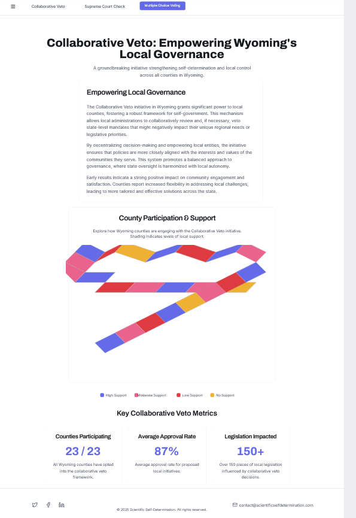

---

## Page Sequence: Supreme Court Check

### Mobile

**Key Elements**
- **Header:** “Supreme Court Check”
- **Main Content:** Description of the 26-state override mechanism
- **Interactive Sections:** “Key Data & Insights” and “Policy Briefs & Analysis” with download icons
- **Footer/Call-to-Action:** Social media icons + contact@ssd.org
- **Mobile Layout:** Stacked layout with simplified map and text

**URL:** /supreme-court-check  
**User Story:**
As a citizen, I want to see a US state-level choropleth map with states proportionally colored based on whether 26 or more object to a supreme court veto, so that I can visually see if the veto threshold is met. The map must have a legend that is visible and descriptive, the data sources used must be clearly cited; and hover text must include exact counts. (Priority: High)
**Sprint:** Sprint 4 – Mar 2–Mar 22

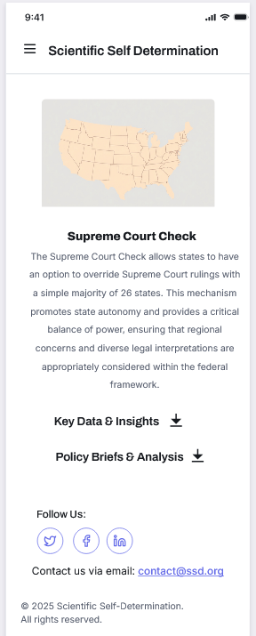

### Desktop

**Key Elements**
- **Title:** “Supreme Court Check”
- **Main Content:** Description of state override mechanism
- **Visual:** Stylized US map with highlighted states
- **Data Section:** Active States, Judicial Proposals, Public Participation, Historical Cases
- **Policy Section:** Legal Theory, Economics, Public Opinion briefs
- **Footer:** Social media icons + contact@scientificselfdetermination.com

**URL:** /supreme-court-check  
**User Story:**
As a citizen, I want to see a US state-level choropleth map with states proportionally colored based on whether 26 or more object to a supreme court veto, so that I can visually see if the veto threshold is met. The map must have a legend that is visible and descriptive, the data sources used must be clearly cited; and hover text must include exact counts. (Priority: High)

**Sprint:** Sprint 4 – Mar 2–Mar 22

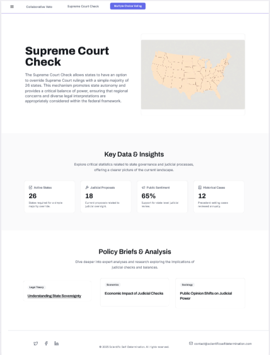

---

## Page Sequence: Multiple Choice Voting

### Mobile

**Key Elements**
- **Header:** “Scientific Self Determination”
- **Main Content:** Bar chart labeled “I”, “E”, “C”, “P”, “S”, “A”
- **Text Block:** Explanation of collaborative voting benefits
- **Footer/Call-to-Action:** Social media icons + contact@ssd.org
- **Mobile Layout:** Simplified chart and stacked text

**URL:** /multiple-choice-voting  
**User Story:**
As a citizen, I want to view a Plotly bar chart showing candidate approval totals under multiple choice voting so that I can compare how many citizens support each candidate. To be acceptable, the visualization should load quickly (> 3s) and be clearly labelled and legible. (Priority: High)

**Sprint:** Sprint 3 – Feb 17–Mar 1

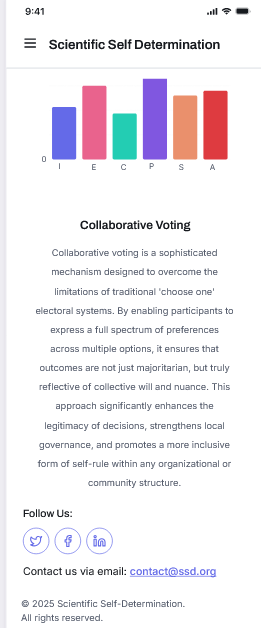

### Desktop

**Key Elements**
- **Title:** “Collaborative Voting”
- **Main Content:** Paragraph explaining collaborative voting
- **Visual:** Bar chart titled “Collaborative Voting Impact Metrics”
- **Benefits Section:** Enhanced Representation, Reduced Polarization, Improved Decision-Making
- **Footer:** contact@scientificselfdetermination.org

**URL:** /multiple-choice-voting  
**User Story:**
As a citizen, I want to view a Plotly bar chart showing candidate approval totals under multiple choice voting so that I can compare how many citizens support each candidate. To be acceptable, the visualization should load quickly (> 3s) and be clearly labelled and legible. (Priority: High) 
**Sprint:** Sprint 3 – Feb 17–Mar 1

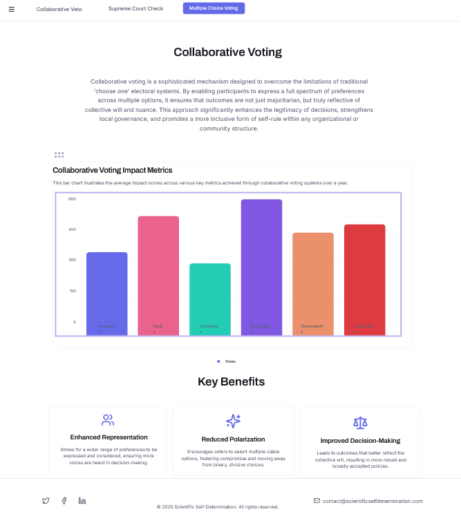

---

## Page Sequence: Minimum Space Visualization

### Mobile

**Key Elements**
- **Header:** “Scientific Self Determination”
- **Main Content:** Map of Wyoming with shaded zones
- **Metrics Section:** Optimal Zone Coverage, Average Density, Unallocated Space
- **Footer/Call-to-Action:** Social media icons + contact@ssd.org
- **Mobile Layout:** Stacked layout with simplified map and metrics

**URL:** /minimum-space  
**User Story:** As a citizen, I want to view a Plotly bar chart showing candidate approval totals under multiple choice voting so that I can compare how many citizens support each candidate. To be acceptable, the visualization should load quickly (> 3s) and be clearly labelled and legible. (Priority: High)
 
**Sprint:** Sprint 7 – Apr 20–May 3

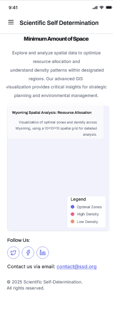

### Desktop

**Key Elements**
- **Title:** “Minimum Amount of Space”
- **Main Content:** Explanation of spatial data and GIS visualization
- **Visual:** Wyoming map with legend (Optimal Zone, Average Density, Unallocated Space)
- **Metrics Section:** Coverage %, Density, Unallocated Area
- **Footer:** contact@scientificselfdetermination.com

**URL:** /minimum-space  
**User Story:** As a citizen, I want to view a Plotly bar chart showing candidate approval totals under multiple choice voting so that I can compare how many citizens support each candidate. To be acceptable, the visualization should load quickly (> 3s) and be clearly labelled and legible. (Priority: High)
 
**Sprint:** Sprint 7 – Apr 20–May 3

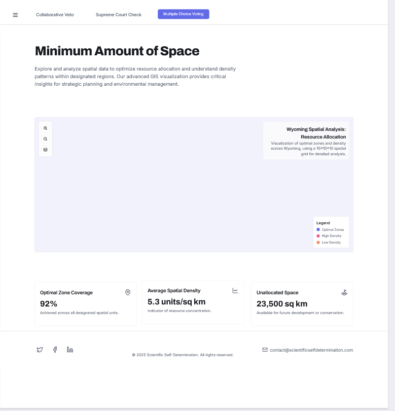

---

## Page Sequence: Contact & Resources

### Mobile

**Key Elements**
- **Header:** “Scientific Self Determination”
- **Main Content:** Contact message and details (email, phone, location)
- **Resources Section:**   FAQ, link for more information on project
- **Footer/Call-to-Action:** Social media icons + contact@scientificsd.com
- **Mobile Layout:** Stacked layout with icons and links

**URL:** /contact  
**User Storys:** As a citizen accessing the site, I want to be sure that the site is secure, and uses the most up-to-date security features. It should implement HTTPS, for instance. (Priority: High)
And:
As a non-profit admin, I want the documentation content to be organized and written with updated and timely examples so that educational materials are clearer and more engaging. Documentation should include visuals, clear headings, and be version-controlled. (Priority: High)

**Sprint:** Sprint 8 – May 4–May 8

### Desktop

**Key Elements**
- **Header:** “Contact Us”
- **Main Content:** Message inviting collaboration and support
- **Contact Info:** Email, phone, office location
- **Visual:** Inviting image
- **Resources Section:** FAQ, social media links, links related to project
- **Footer:** contact@scientificselfdetermination.com + © 2026 SSD

**URL:** /contact  
**User Storys:**As a citizen accessing the site, I want to be sure that the site is secure, and uses the most up-to-date security features. It should implement HTTPS, for instance. (Priority: High)
And:
As a non-profit admin, I want the documentation content to be organized and written with updated and timely examples so that educational materials are clearer and more engaging. Documentation should include visuals, clear headings, and be version-controlled. (Priority: High)

**Sprint:** Sprint 8 – May 4–May 8

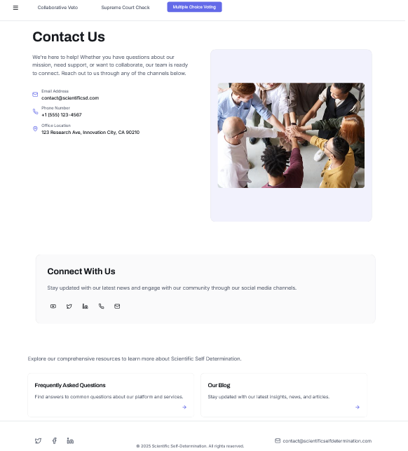

--- 

## Page Sequence: Menu & Navigation

### Mobile

**Key Elements**
- **Header:** “Scientific Self Determination”
- **Navigation Menu:** Vertical list with links to Collaborative Veto, Supreme Court Check, Multiple Choice Voting, Contact Us, FAQ, Blog, Resources, Minimum Space
- **Footer/Call-to-Action:** Social media icons (Facebook, Twitter, LinkedIn, Instagram) + contact@ssd.org
- **Mobile Layout:** Stacked navigation with icons at bottom

**URL:** N/A  
**User Story:**  
As a citizen, I want to visit the site and read clear, updated definitions of governance models so that I understand concepts like “collaborative veto,” “multiple choice voting,” and “supreme court veto.” The pages should be dated so that I can determine their recency, be reviewed for accuracy, and displayed in a legible and accessible format. (Priority: High)

**Sprint:** Sprint 2 – Feb 3–Feb 16

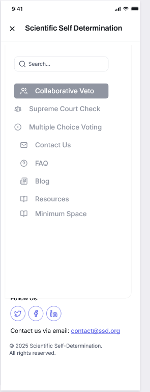

### Desktop

**Key Elements**
- **Header:** “Empowering Informed Decisions Through Data and Dialogue”
- **Navigation Menu (Left):** Links to Collaborative Veto, Supreme Court Check, Multiple Choice Voting, Contact Us, FAQ, Resources, Minimum Space
- **Main Content:** Paragraph describing SSD’s mission and methodology
- **Visual:** Abstract 3D bubble-like illustration
- **Footer:** contact@scientificselfdetermination.org + © 2023 SSD

**URL:** N/A  
**User Story:**  
As a citizen, I want to visit the site and read clear, updated definitions of governance models so that I understand concepts like “collaborative veto,” “multiple choice voting,” and “supreme court veto.” The pages should be dated so that I can determine their recency, be reviewed for accuracy, and displayed in a legible and accessible format. (Priority: High)

**Sprint:** Sprint 2 – Feb 3–Feb 16

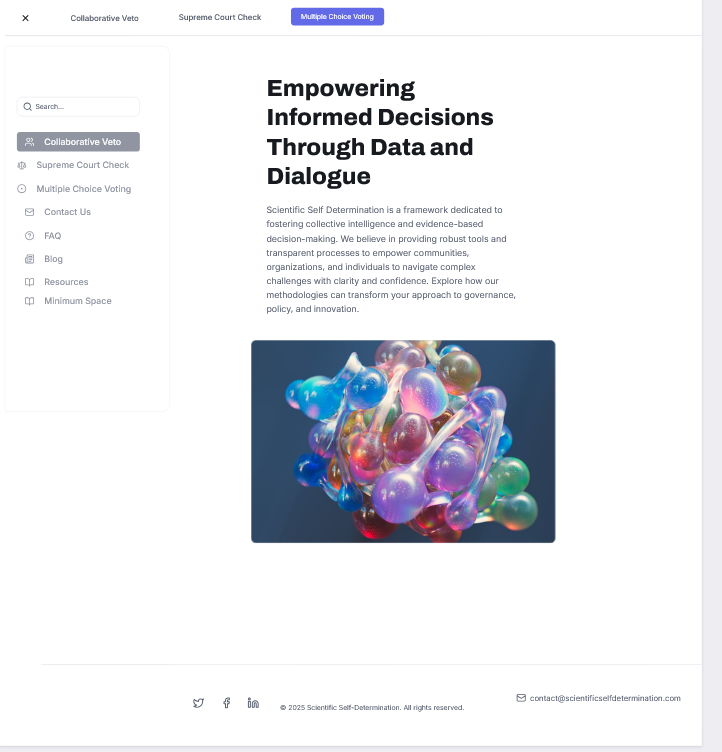
